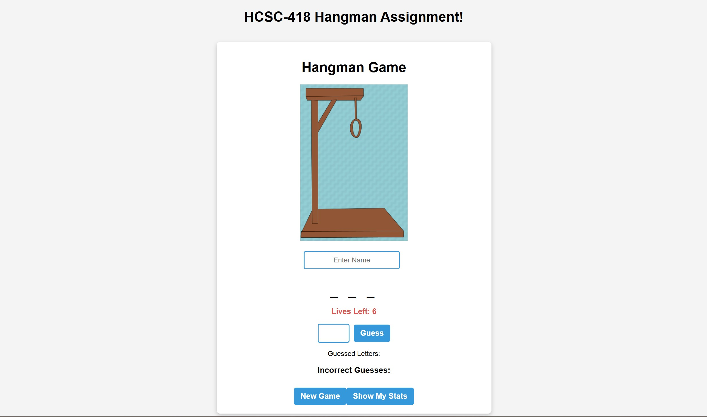

# Hangman Game Project (Version 2.0 w/ Enhancements)

This is an enhanced, full-stack version of the classic Hangman game built with React, Node.js, Express, MongoDB, and Docker Compose. It includes player tracking, win/loss recording, and a polished UI experience.

---

## What's New in Version 2.0

This updated version includes several enhancements over the original Hangman app:

- Added unit tests using Jest to ensure the reliability of the game logic
- Integrated a backend server using Node.js and Express
- Connected a MongoDB database (via Docker Compose) to store player statistics
- Tracked each player's number of wins and losses
- Calculated and displayed winning percentages
- Allowed players to view their own stats using the "Show My Stats" button
- Improved the user interface with a name input field and welcome message

---
---

## **Features**

✔️ Renders a **HangmanGame** component that controls the game logic  
✔️ Allows users to:

- Enter their name to personalize the game and track their stats
- Guess one letter at a time
- View incorrect guesses
- See a masked version of the word  
  ✔️ Updates the hangman image with each incorrect guess  
  ✔️ Displays **win/lose conditions** based on the number of incorrect guesses  
  ✔️ Sends game results to a backend for storage  
  ✔️ Displays a "Show My Stats" button to retrieve winning percentages  
  ✔️ Includes a **restart button** to start a new game

---
---

### **Files Overview**

- **`HangmanGame.js`** - The **main component** that handles game logic, word selection, user interaction, and API communication.
- **`SingleLetterSearchBar.js`** - The **input component** where users enter letter guesses.
- **`LetterBox.js`** - Displays incorrect guesses in individual styled boxes.
- **`index.js`** - The **entry point** that renders the `HangmanGame` component.
- **`App.css` & `index.css`** - Styling files to enhance UI.
- **`hangmanLogic.js`** - Reusable logic for initializing the game and processing guesses (testable).
- **`hangmanLogic.test.js`** - Unit tests written using Jest to validate core game logic.
- **`backend/server.js`** - Express server that stores player stats in MongoDB and returns results via API.
- **`docker-compose.yml`** - Starts both the backend and MongoDB database together with one command.
- **`index.html`** - The main HTML file for rendering the React app.

---
---

## **How It Works**

### **Main Component (`HangmanGame.js`)**

- Selects a **random word** from a predefined list.
- Manages **state** for:
  - The current word
  - The masked word display
  - Correct and incorrect guesses
  - The number of remaining lives
  - Game over and win conditions
  - Player name
- Sends player results to the backend when a game ends.
- Fetches player stats when "Show My Stats" is clicked.

### **Input Component (`SingleLetterSearchBar.js`)**

- Allows users to enter **one letter at a time**.
- Validates input to ensure only a **single letter (A-Z)** is entered.
- Calls the `handleGuess` function in `HangmanGame.js` to process guesses.

### **Incorrect Letters Display (`LetterBox.js`)**

- Displays incorrect guesses in **red-styled boxes**.
- Updates dynamically as the user makes incorrect guesses.

---
---

## **Installation & Setup**

1. **Clone this repository**:

   ```sh
   git clone https://github.com/your-username/react-parent-child-demo.git
   cd react-parent-child-demo
   ```

2. **Navigate to the Project Folder**:

   ```bash
   cd your-repo-name
   ```

3. **Install Dependencies**:

   ```bash
   npm install
   ```

4. **Start the Development Server**:

   ```bash
   npm start
   ```

5. **Open the Application**:
   ```bash
   The app will open automatically in your browser at http://localhost:3000
   If it doesnt, manually navigate to http://localhost:3000
   ```


   ---
   ---
## Running Docker and MongoDB

This project uses Docker Compose to run both the backend server and the MongoDB database in containers.

### Prerequisites

- Install [Docker Desktop](https://www.docker.com/products/docker-desktop/) for Windows/Mac  
- Make sure Docker is running before you continue


### How to Start Docker Services

From the root of your project folder, run the following command:

```bash
docker compose up --build
```
- Builds and starts the backend server (Node.js + Express)
- Pulls and starts a MongoDB container
- Connects both services automatically via Docker
The backend will run @http://localhost:5000
MongoDB will be accessbile internally @mongodb://mongo:27017/hangmanDB

### How to Stop Docker Services
To shut everything down, press Ctrl + C in the terminal, then run:

```bash
docker compose down
```
- This will stop and remove the containers, but keep your data in the mounted volume (mongo-data)

---
---

## Application Screenshot



